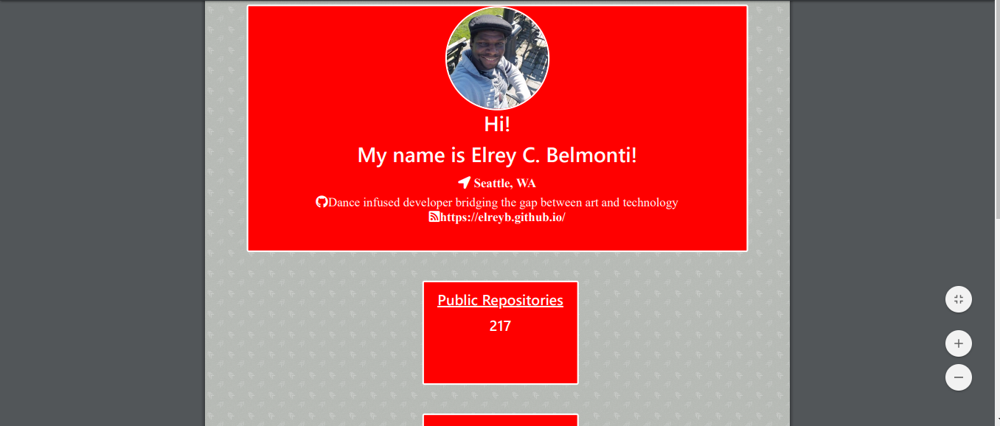

# Node-JS-HW-09

For our 9th coding camp homework assignment, we were given the task of creating and developing a generated GitHub profile template. This application featured several API calls to populate an informative PDF page, featuring the user's information such as their GitHub profile picture, location, blog, and number of repositories. I created this assignment in an index.js file, running the contents through node.js. Node and JavaScript ES6 were all newly learned and employed successfully to create a responsive, user experience.

## Motivation

Node.js is a newer concept but I enjoyed using it and pairing it with our previously learned programming languages. While the exercise was a difficult endeavor, gaining familiarity with ES6 as well as specific contents like "inquirer" and "async" functions helped me to gain a good understanding of the material.

## Features

Homework 9 introduced me to many new concepts, helping me to branch out from what was comfortable. The user is prompted after running node.js of their GitHub profile name as well as a color choice. These two choices call an API and open up a generated PDF in the Chrome Browser. This PDF has selected contents with the user selected background-color. It also contains their personal GitHub information, making it a unique experience for every user. The index.js file features ES6 language throughout, helping to make the code up to date. All-together, Homework-9 is a functional application that provides the user with a seamless, personal experience.

References:
https://gist.github.com/derhuerst/19e0844796fa3b62e1e9567a1dc0b5a3

https://guide.freecodecamp.org/git/gitignore/

https://www.npmjs.com/package/inquirer
